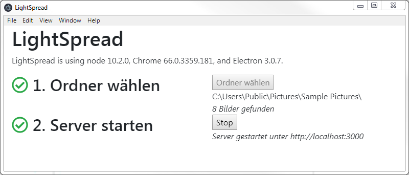
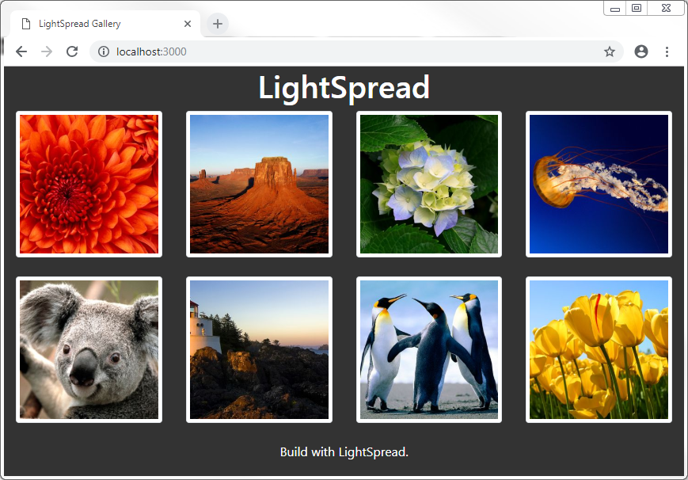
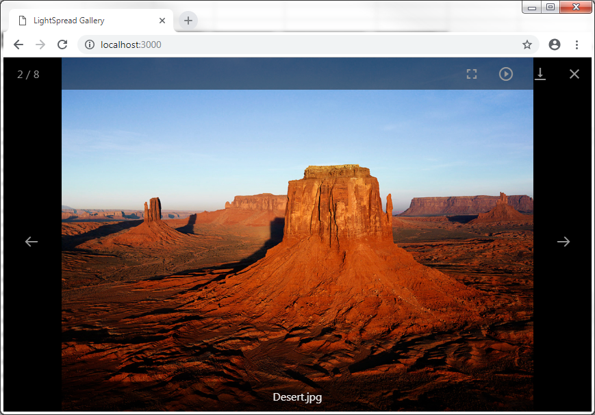

# LightSpread

LightSpread allows you to present your images in a slideshow for big screens.
It also comes with a webserver for your audience to glance through the gallery and downloading your pictures with their smartphones.

## How to use

### 1. Choose your picture folder and start the server

### 2. Start the Slideshow on your monitor/beamer

Best experience: Go fullscreen and start autoplay

### 3. Users can scroll and download the pictures with their smartphones

